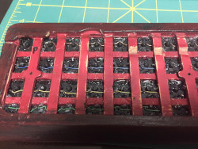

# Photo for gcg56
<!---
vim:set tw=79 ts=4 sts=4 sw=4 et nosi filetype=markdown:
-->

XXXFIXME XXX

* Keyboard as it built with LEDs 
* wiring in progress (step 0) 

Original case for the speaker was removed to make it fit inside.

