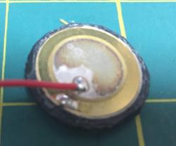

# Photo for cg56
<!---
vim:set tw=79 ts=4 sts=4 sw=4 et nosi filetype=markdown:
-->

## Photos

See [photo](photo.md)

* Keyboard as it built with LEDs 
* wiring in progress (step 0) 
* Front side of speaker 
* Back side of speaker 

Original case for the speaker was removed to make it fit inside.

