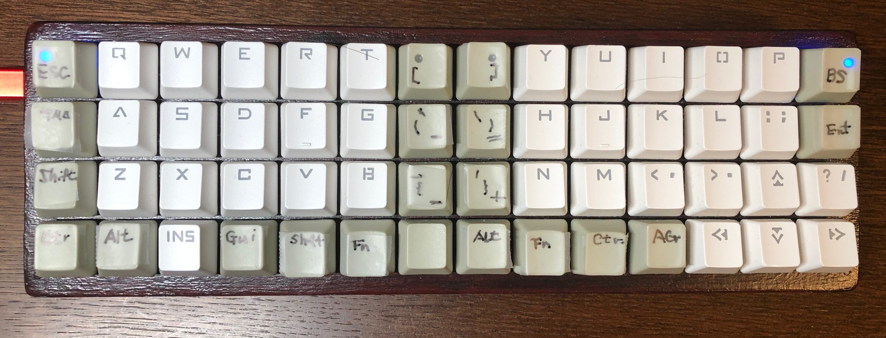
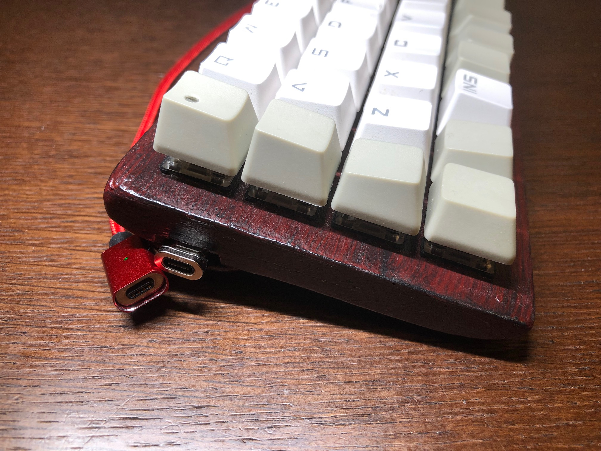
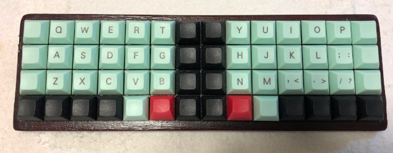
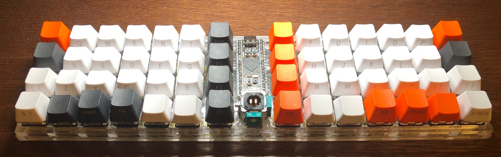
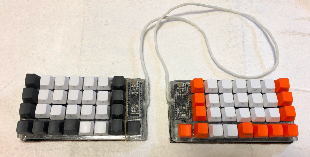
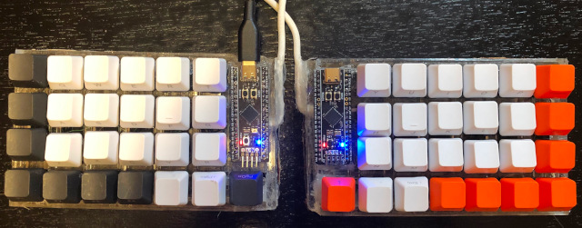

# Grid Keyboard with 56 keys and its variants
<!---
vim:set tw=79 ts=4 sts=4 sw=4 et nosi filetype=markdown:
-->

This repo hosts data and some documents for my handwared keyboard projects. I
call this repository as cg56 which stands for Cartesian Grid Keyboard with 56
keys.  The corresponding keyboard name in my QMK source is cgc56 which stands
for Cartesian Grid Keyboard (compact) with 56 keys.  The longer name is chosen
to differentiate variants.

## Related memo in Japanese

There are more detailed memos in Japanese on how my hobby project proceeded
slowly since 2016. (Now 2022)  Its highlights are:

* https://osamuaoki.github.io/jp/2020/01/03/cg56-1/
* https://osamuaoki.github.io/jp/2021/12/11/atmega32u4-4/
* https://osamuaoki.github.io/jp/2022/02/07/blackpill-1/
* https://osamuaoki.github.io/jp/2022/03/15/home-mt/
* https://osamuaoki.github.io/jp/2022/09/01/blackpill-4/
* https://osamuaoki.github.io/jp/2022/09/09/home-mt2/ (review)

## Keyboard project history

* cg56: Cartesian Grid Keyboard with 56 keys (2016-2018)
    * NC laser cut MDF board (cut, stacked, glued, filed, and painted)
    * 56 keys (14 x 4)
    * ATMega32u4 x 1 (teensy 2 compatible board with nanoBoot HID bootloader)
    * Project stalled and case is repurposed for the next cgc56 project.
    * [NC CAD data (dxf) is in this repository](cad/cg56.dxf)
    * [NC CAD data (pdf) is in this repository](cad/MDF_CUT_grid56w.pdf)
    * See [ATmega32u4 (rev01)](rev01.md) -- never made -- for details of around MCU and shape of key matrix.
    * See [Key matrix for cg56 and cgc56](cg56.md) for electrical details of key matrix.

* cgc56: Cartesian Grid Keyboard (compact) with 56 keys (2022/Feb -- initial)
    * NC laser cut MDF board
      * recycled case taken from stalled cg56
      * Add independent USB connector board.
      * internal space of already built case was enlarged by mechanically grinding the MDF board
    * 56 keys (14 x 4)
    * AT90USB1286 x 1
      * Teensy 2++ compatible circuit board with LUFA HID bootloader
    * initial cgc56 front view with OEM keycaps
      <br>
      
    * cgc56 side view with OEM key caps
      <br>
      
    * See [AT90USB1286 (rev02)](rev02.md) for details of around MCU and shape of key matrix.
    * See [Key matrix for cg56 and cgc56](cg56.md) for electrical details of key matrix.
    * See [cgc56 in Osamu's QMK fork with osamu1 branch](https://github.com/osamuaoki/qmk_firmware/blob/osamu1/keyboards/cgc56/keymaps/default/keymap.c)  -- this is not maintained.
    * See [extra photo for cg56](photo-cg56.md)


* **cgc56**: Cartesian Grid Keyboard (compact) with 56 keys (2022/Sep)
    * Keycaps are changed to DSA.
      * The front edge of red keycaps for the thumb are rounded using the sand
        paper.
      * keymaps are optimized (now "pico" is used)
    * 56 keys (14 x 4) -- no change
    * AT90USB1286 x 1 -- no change
      <br>
    * updated cgc56 top view with DSA keycaps for the pico keymap
      
    * See [cgc56 in Osamu's QMK fork with osamu1 branch](https://github.com/osamuaoki/qmk_firmware/blob/osamu1/keyboards/cgc56/keymaps/pico/keymap.c) -- this is maintained.

* cgg56: Cartesian Grid Keyboard (gap) with 56 keys (2022/Feb)
    * Hand cut and glued 5mm x 5mm plastic bars
    * 56 keys (14 x 4) + X-Y joystick (resistive)
    * STM32F411CE x 1 (WeAct Blackpill)
    * cgg56 front view with OEM keycaps
      <br>
      
    * See [STM32F411CEU6 (rev03)](rev03.md) for details of around MCU and shape of key matrix.
    * See [Key matrix for gcg56](cgg56.md) for electrical details of key matrix.
    * See [STM32F411CE (1)](https://osamuaoki.github.io/jp/2022/02/07/blackpill-1/) (Japanese) for cgg56
    * See [cgg56 in Osamu's QMK fork with osamu1 branch](https://github.com/osamuaoki/qmk_firmware/blob/osamu1/keyboards/cgg56/keymaps/pico/keymap.c) -- this is not maintained.

* cgs58: Cartesian Grid Keyboard (split) with 58 keys
    * Hand cut and glued 5mm x 5mm plastic bars
      * recycled case taken from cgg56
      * hack sawed cgg56 at the center and extended with glued 5mm x 5mm plastic bars
    * 58 keys ((7 x 4 + 1) x 2)
    * STM32F411CE x 2 (WeAct Blackpill)
    * cgs58 front view with OEM keycaps
      <br>
      
    * This is 16U wide and can't fit into A4 size case. (Too big!)
    * See [STM32F411CE (4)](https://osamuaoki.github.io/jp/2022/09/01/blackpill-4/) (Japanese) for the modification from cgg56 to cgs58.
    * See [cgs58 in Osamu's QMK fork with osamu1 branch](https://github.com/osamuaoki/qmk_firmware/blob/osamu1/keyboards/cgs58/keymaps/pico/keymap.c) -- this is not maintained.

* **cgs50**: Cartesian Grid Keyboard (split) with 50 keys (2022/Sep)
    * Hand cut and glued 5mm x 5mm plastic bars
      * recycled case taken from cgs58
      * hack sawed cgs58 at the both ends and glued 5mm x 5mm plastic bars to close the ends.
    * 50 keys ((6 x 4 + 1) x 2)
    * STM32F411CE x 2 (WeAct Blackpill)
    * cgs50 front view with OEM keycaps
      <br>
      
    * This is 14U wide and can fit into A4 size case.
    * Just cut both ends and removed wiring around them.
    * See [cgs58 in Osamu's QMK fork with osamu1 branch](https://github.com/osamuaoki/qmk_firmware/blob/osamu1/keyboards/cgs50/keymaps/pico/keymap.c) -- this is maintained.

## Background

I felt pain between my right ring and pinkie fingers.  I wondered why I suffer
such a pain since I type very slowly and my slow typing should be very low
stress on my fingers.  I then realized that I stretch my pinkie finger to reach
"Enter" and "BS" keys which are away from the home position of my right pinkie
finger.  Situation with laptop JIS (JA) keyboard which I now use regularly is
worse than ANSI (US) keyboard since the "Enter" key is 3 steps away.

Even on the ANSI (US) 104 keyboard, my weak right pinkie finger is covering 20
keys while even my capable right pointer finger covers only 9 keys and most
other fingers cover less.  Although these extra keys typed by my right pinkie
finger are mostly rarely typed keys, these are used more for coding programs.

Also, un-natural staggered key arrangement is another annoyance to twist my
body.  The default positions of hands seem to be too close to each other for me
to keep my good posture.

Hmmm... I need to keep my posture right while keeping my fingers relaxed.

## Design Policy

The following design policy is deployed to design a custom keyboard.

* Use only FREE software (DFSG compliant)
* Compact, simple, and natural design
    * Compact enough to be portable: 56 keys (4 rows x 14 columns) or less
    * Keys in the linear orthogonal Cartesian grid coordinate positions
    * Never move pinkie fingers more than one column away.
    * Never move pointer fingers more than two column away.
    * Keep left and right fingers separated enough.
    * All ASCII codes are accessible without moving the palm position.
* Least leaning pain key-position design
    * Minimal key-position change from the standard ANSI (US).
    * BS at the right top corner.
    * ESC in place of CapsLock position (yay, Vim).
    * Keep F and J keys separated with 4 keys (or more) instead of standard 2 keys.
    * Move non-shift non-alphabet symbols to the center if you ever have them.
    * Layer changing Fn keys in thumb home positions to offer practically all ANSI 104 (JIS 106?) keys.
        * Function keys (F1-F12) are in the top row with Fn.
        * Number keys are in the high-middle row with Fn.
        * Odd keys are in the low-middle row with Fn
    * SPACE should be at the thumb position of the bottom row.
    * Cursor keys are in the hard to reach part of the bottom row if you ever have them.
    * Topography effects to find finger home positions
      * Use key cap height differences with the OEM keycaps.
      * Use mechanically modified thumb keys with DSA keycaps.
* Keep it simple and cheap (It's my first custom keyboard!)
    * Use commodity electronics parts (as much)
      * Use the laser cut MDF board as the case (if needed)
      * Use 5mm x 5mm plastic bars and glue purchased at the local hardware
        shop.
    * Use only 1U key caps (=no stabilizer)
    * No PCB but lots of messy hand wiring :-)

## What's different

You may wonder what's different from other so called "ortholinear" keyboards
such as plank.

* Enough distance between left and right hands. (2U->4U)
* 7 columns per one side instead of 6 columns such as
  [plunk](https://olkb.com/planck) to minimize key position irregularities.
* Single piece compact design without irregular shape vs.
  [Ergo42](https://bit-trade-one.co.jp/selfmadekb/adskb42/) and
  [ErgoTravel](https://github.com/jpconstantineau/ErgoTravel) .
* Extensive use of hot-melt glue which should also function as noise dumper.

Yah, it's not much different in basic hardware design ... it's mostly a taste
difference.

As for the pinkie finger stress, the home row mod keymap really helped.

## Design thoughts

Here, ASCII art versions of basic design implementation ideas are provided.

### Case Design for cg56

Case with orthogonal key switch matrix design with enough space for thumb
finger coverage and without stressing pinkie finger.

* Primary positions: `###` (home positions)
* Almost primary positions: `.#.` (almost home positions)
* Adjacent positions: `...` (easy to reach minimum movement positions)

```
┌───┬───┬───┬───┬───┬───┬───┬───┬───┬───┬───┬───┬───┬───┐
│   │...│...│...│...│...│   │   │...│...│...│...│...│   │
├───┼───┼───┼───┼───┼───┼───┼───┼───┼───┼───┼───┼───┼───┤
│...│###│###│###│###│...│...│...│...│###│###│###│###│...│
├───┼───┼───┼───┼───┼───┼───┼───┼───┼───┼───┼───┼───┼───┤
│...│.#.│...│...│.#.│...│...│...│...│.#.│...│...│.#.│...│
├───┼───┼───┼───┼───┼───┼───┼───┼───┼───┼───┼───┼───┼───┤
│...│...│   │   │...│###│...│...│###│...│   │   │...│...│
└───┴───┴───┴───┴───┴───┴───┴───┴───┴───┴───┴───┴───┴───┘
```

### Key Assignment

Use least surprise design based on the standard QWERTY-keyboard.

Here is an example of key assignment.

Initial thought:
```
default
┌───┬───┬───┬───┬───┬───┬───┬───┬───┬───┬───┬───┬───┬───┐
│TAB│ q │ w │ e │ r │ t │ [ │ ] │ y │ u │ i │ o │ p │BS │
├───┼───┼───┼───┼───┼───┼───┼───┼───┼───┼───┼───┼───┼───┤
│ESC│ a │ s │ d │ f │ g │ ` │ \ │ h │ j │ k │ l │ ; │ ' │
├───┼───┼───┼───┼───┼───┼───┼───┼───┼───┼───┼───┼───┼───┤
│Sft│ z │ x │ c │ v │ b │***│***│ n │ m │ , │ . │ / │Sft│
├───┼───┼───┼───┼───┼───┼───┼───┼───┼───┼───┼───┼───┼───┤
│Ctr│Alt│ ↑ │ ↓ │Gui│Fn │Spc│Ent│Fn │App│ ← │ → │Alt│Ctr│
└───┴───┴───┴───┴───┴───┴───┴───┴───┴───┴───┴───┴───┴───┘


Fn-pressed
┌───┬───┬───┬───┬───┬───┬───┬───┬───┬───┬───┬───┬───┬───┐
│Prt│F1 │F2 │F3 │F4 │F5 │F11│F12│F6 │F7 │F8 │F9 │F10│SL │
├───┼───┼───┼───┼───┼───┼───┼───┼───┼───┼───┼───┼───┼───┤
│Cap│ 1 │ 2 │ 3 │ 4 │ 5 │ - │ = │ 6 │ 7 │ 8 │ 9 │ 0 │PB │
├───┼───┼───┼───┼───┼───┼───┼───┼───┼───┼───┼───┼───┼───┤
│___│***│***│***│***│***│***│***│***│***│***│***│***│___│
├───┼───┼───┼───┼───┼───┼───┼───┼───┼───┼───┼───┼───┼───┤
│___│___│Hom│End│Alt│___│Ins│Del│___│Ctl│PgU│PgD│___│___│
└───┴───┴───┴───┴───┴───┴───┴───┴───┴───┴───┴───┴───┴───┘
```

[Current QMK setting: (2022/Sep)](https://github.com/osamuaoki/qmk_firmware/blob/osamu1/keyboards/cgc56/keymaps/pico/keymap.c)
 -- with many tap-hold dual function keys.
```
0th layer: Normal tap (Essential stable keys only)
┌───┬───┬───┬───┬───┬───┬───┬───┬───┬───┬───┬───┬───┬───┐
│Tab│ Q │ W │ E │ R │ T │   │   │ Y │ U │ I │ O │ P │BS │
├───┼───┼───┼───┼───┼───┼───┼───┼───┼───┼───┼───┼───┼───┤
│Esc│ A │ S │ D │ F │ G │   │   │ H │ J │ K │ L │ ; │Ent│
├───┼───┼───┼───┼───┼───┼───┼───┼───┼───┼───┼───┼───┼───┤
│Mut│ Z │ X │ C │ V │ B │   │   │ N │ M │ , │ . │ / │Psc│
├───┼───┼───┼───┼───┼───┼───┼───┼───┼───┼───┼───┼───┼───┤
│   │   │   │   │MUH│Spc│   │   │Spc│HEN│   │   │   │   │
└───┴───┴───┴───┴───┴───┴───┴───┴───┴───┴───┴───┴───┴───┘

0th layer: Normal hold (MOD and LAYER keys)
┌───┬───┬───┬───┬───┬───┬───┬───┬───┬───┬───┬───┬───┬───┐
│   │   │   │   │   │   │   │   │   │   │   │   │   │   │
├───┼───┼───┼───┼───┼───┼───┼───┼───┼───┼───┼───┼───┼───┤
│Ctl│Sft│Crl│Alt│Gui│Agr│   │   │Agr│Gui│Alt│Ctl│Sft│   │
├───┼───┼───┼───┼───┼───┼───┼───┼───┼───┼───┼───┼───┼───┤
│Sft│   │   │Gui│MO2│   │   │   │   │   │   │   │   │Sft│
├───┼───┼───┼───┼───┼───┼───┼───┼───┼───┼───┼───┼───┼───┤
│   │   │   │   │   │   │   │   │   │   │   │   │   │   │
└───┴───┴───┴───┴───┴───┴───┴───┴───┴───┴───┴───┴───┴───┘

1st layer: activate with one Fn-key (= space key) pressed as hold
┌───┬───┬───┬───┬───┬───┬───┬───┬───┬───┬───┬───┬───┬───┐
│F11│F1 │F2 │F3 │F4 │F5 │   │   │F6 │F7 │F8 │F9 │F10│F12│
├───┼───┼───┼───┼───┼───┼───┼───┼───┼───┼───┼───┼───┼───┤
│Cap│ 1 │ 2 │ 3 │ 4 │ 5 │   │   │ 6 │ 7 │ 8 │ 9 │ 0 │App│
├───┼───┼───┼───┼───┼───┼───┼───┼───┼───┼───┼───┼───┼───┤
│   │ ` │   │   │ - │ = │   │   │ { │ } │ \ │   │ ' │LL2│
├───┼───┼───┼───┼───┼───┼───┼───┼───┼───┼───┼───┼───┼───┤
│   │   │   │   │   │vvv│   │   │vvv│KAN│   │   │   │   │
└───┴───┴───┴───┴───┴───┴───┴───┴───┴───┴───┴───┴───┴───┘

```
Please note:

* "shift-pressed" causes the normal shift conversion
* Missing function keys are generated by Fn-pressed Q-row keys.
* Missing number row keys are generated by Fn-pressed A-row keys.
* Missing outlier keys are generated by Fn-pressed Z-row keys.
* Let's worry about details later when in QMK firmware.
* Actual key layout will be experimentally determined.
  * 2nd layer: cursor
  * 3rd layer: ten-keys
  * 4th layer: mouse keys and system control

### Keyboard Topography (Type 1)

OEM 1U Key cap are used as below to offer optimal topography.


```
┌───┬───┬───┬───┬───┬───┬───┬───┬───┬───┬───┬───┬───┬───┐
│*1 │ Q │ Q │ Q │ Q │ Q │*1 │ 1*│ Q │ Q │ Q │ Q │ Q │ 1*│
├───┼───┼───┼───┼───┼───┼───┼───┼───┼───┼───┼───┼───┼───┤
│ 1 │_A_│_A_│_A_│_A_│ A │ 1 │ 1 │ A │_A_│_A_│_A_│_A_│ 1 │
├───┼───┼───┼───┼───┼───┼───┼───┼───┼───┼───┼───┼───┼───┤
│ Z │ Z │ Z │ Z │ Z │ Z │ 1 │ 1 │ Z │ Z │ Z │ Z │ Z │ Z │
├───┼───┼───┼───┼───┼───┼───┼───┼───┼───┼───┼───┼───┼───┤
│ A │ Z │ R │ R │ 1 │_Q_│ 1 │ 1 │_Q_│ 1 │ R │ R │ Z │ A │
└───┴───┴───┴───┴───┴───┴───┴───┴───┴───┴───┴───┴───┴───┘
 1:   1-row type
 Q:   Q-row type
 A:   A-row type
 Z:   Z-row type
 R:   Arrow-keys inserted upside down
 _ _: home position
 *:   LED position (outside is RED LED)
```

With the height difference to the adjacent keys, thumb and pinkie fingers
should have easier time to feel its home position.  (I may change height
combination later.)

Also by deploying higher keys (1-row type) for far-away keys, you can type
these keys by pressing their side faces.  They may not be bigger but are
easy to be reached.

### Keyboard Topography (Type 2)

Alternatively, DSA key tops may be used.

For that, I thought that modifying some keys with soft UV-resin or
crazy-glue+baking-soda may be interesting options to create topography.

I ended up grinding off front edge of thumb keys.


## Sitalled side project -- QWFRTY layout

**QWFRTY** layout was investigated as a minimal learning stress alternative layout but it was not so good.

* **QWFRTY** moves only 11-keys from the standard QWERTY.  Almost all short-cuts stay in place.
* **QWFRTY** encourages alternating hand typing like DVORAK by having all vowel characters on one side.  This should be lower stress.
  **QWFRTY** doesn't trash the user experience under Vim.  `hjkl`-keys are clustered as inverse-T making it even better than QWFRTY.


See https://osamuaoki.github.io/jp/2022/02/14/qwfrty/ (Japanese)


