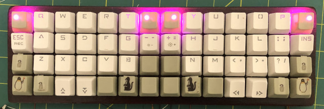

# Cartesian Grid Keyboard with 56 keys (cg56)
<!---
vim:set tw=79 ts=4 sts=4 sw=4 et nosi filetype=markdown:
-->



## Background

I felt pain between my right ring and pinkie fingers.  I wondered why I suffer
such a pain since I type very slowly and my slow typing should be very low
stress on my fingers.  I then realized that I stretch my pinkie finger to reach
"Enter" and "BS" keys which are away from the home position of my right pinkie
finger.  Situation with laptop JIS (JA) keyboard which I now use regularly is
worse than ANSI (US) keyboard since the "Enter" key is 3 steps away.

Even on the ANSI (US) 104 keyboard, my weak right pinkie finger is covering 20
keys while even my capable right pointer finger covers only 9 keys and most
other fingers cover less.  Although these extra keys typed by my right pinkie
finger are mostly rarely typed keys, these are used more for coding programs.

Also, un-natural staggered key arrangement is another annoyance to twist my
body.  The default positions of hands seem to be too close to each other for me
to keep my good posture.

Hmmm... I need to keep my posture right while keeping my fingers relaxed.

## Design Policy

The following design policy is deployed to design a custom keyboard.

* Use only FREE software (DFSG compliant)
* Compact, simple, and natural design
    * Compact enough to be portable: 56 keys (4 rows x 14 columns)
    * Keys in the linear orthogonal Cartesian grid coordinate positions
    * Never move pinkie fingers more than one column away.
    * Never move pointer fingers more than two column away.
    * Keep left and right fingers separated enough.
    * All ASCII codes are accessible without moving the palm position.
* Least leaning pain key-position design
    * Minimal key-position change from the standard ANSI (US).
    * BS at the right top corner.
    * TAB next to "Q".
    * ESC in place of CapsLock position (yay, Vim).
    * Keep F and J keys separated with 4 keys instead of standard 2 keys.
    * Move non-shift non-alphabet symbols to the center.
    * FnU/FnD keys in thumb home positions to offer practically all 109 keys.
        * Function keys are in the top row with FnU.
        * Number keys are in the high-middle row with FnU.
        * Symbol keys (`!@#$%^&*()`) are in the high-middle row with FnD.
        * Odd keys are in the low-middle row with FnD/FnU
    * SPACE should be at the center of the bottom row.
    * Cursor keys are in the hard to reach part of the bottom row.
    * 3D-like effect using Key cap height differences with OEM key caps.
* 4 LEDs on top row keys * 2 colors = 8 GPIO (ON/OFF)
    * Cathode common LED (R:outside +B:inside)
* Keep it simple and cheap (It's my first custom keyboard!)
    * Use commodity electronics parts
    * Use the laser cut MDF board as the case
    * Use only 1U key caps from the OEM 87 key cap set (=no stabilizer)
    * No PCB but lots of messy hand wiring :-)

## What's different

You may wonder what's different from other so called "ortholinear" keyboards.

* Less stress to pinkie fingers.
* Enough distance between left and right hands. (2U->4U)
* 7 columns per one side instead of 6 columns such as
  [plunk](https://olkb.com/planck).
* Single piece compact design without irregular shape vs.
  [Ergo42](https://bit-trade-one.co.jp/selfmadekb/adskb42/) and
  [ErgoTravel](https://github.com/jpconstantineau/ErgoTravel) .
* Extensive use of hot-melt glue which should also function as noise dumper.

Yah, it's not much different in basic hardware design ... it's mostly a taste
difference.

## Design

Here, ASCII art versions of basic design implementation data are provided.

### Case Design


LibreCAD was used to create DXF (drawing exchange format) file for case.

* [Keyboard case CAD data](cad/cg56.dxf)

MDF was cut by laser using this data.  Small holes are used to position each
piece using wooen tooth picks.  Some file works were applied to round the edges
and paper plaster was used to fill uneven surfaces.  So the resulting keyboard
case has a smooth shape.

### Key Assignment

Here is an example of key assignment.

```
default
┌───┬───┬───┬───┬───┬───┬───┬───┬───┬───┬───┬───┬───┬───┐
│TAB│ q │ w │ e │ r │ t │ [ │ ] │ y │ u │ i │ o │ p │BS │
├───┼───┼───┼───┼───┼───┼───┼───┼───┼───┼───┼───┼───┼───┤
│ESC│ a │ s │ d │ f │ g │ ` │ \ │ h │ j │ k │ l │ ; │ ' │
├───┼───┼───┼───┼───┼───┼───┼───┼───┼───┼───┼───┼───┼───┤
│Sft│ z │ x │ c │ v │ b │***│***│ n │ m │ , │ . │ / │Sft│
├───┼───┼───┼───┼───┼───┼───┼───┼───┼───┼───┼───┼───┼───┤
│Ctr│Alt│ ↑ │ ↓ │Gui│FnD│Spc│Spc│FnU│Gui│ ← │ → │Alt│Ctr│
└───┴───┴───┴───┴───┴───┴───┴───┴───┴───┴───┴───┴───┴───┘


FnD-pressed
┌───┬───┬───┬───┬───┬───┬───┬───┬───┬───┬───┬───┬───┬───┐
│Prt│F1 │F2 │F3 │F4 │F5 │F11│F12│F6 │F7 │F8 │F9 │F10│Del│
├───┼───┼───┼───┼───┼───┼───┼───┼───┼───┼───┼───┼───┼───┤
│Cap│ 1 │ 2 │ 3 │ 4 │ 5 │ - │ = │ 6 │ 7 │ 8 │ 9 │ 0 │Ins│
├───┼───┼───┼───┼───┼───┼───┼───┼───┼───┼───┼───┼───┼───┤
│___│***│***│***│***│***│***│***│***│***│***│***│***│___│
├───┼───┼───┼───┼───┼───┼───┼───┼───┼───┼───┼───┼───┼───┤
│___│___│Hom│End│App│___│Ent│Etr│___│App│PgU│PgD│___│___│
└───┴───┴───┴───┴───┴───┴───┴───┴───┴───┴───┴───┴───┴───┘

```

Please note:

* "shift-pressed" causes the normal shift conversion
* For missing number row keys, numbers are generated by FnD-pressed A-row keys.
* For missing number row keys, symbols are generated by FnU-pressed A-row keys.
* Function keys are generated by FnU/FnD-pressed Q-row keys.
* FnD is called "lower" and FnU is called "raise".
* All `*` keys are user customizable and can be assigned to any valid USB keyboard code.
* http://www.keyboard-layout-editor.com/#/gists/2f5cc555a34c29650d73561a03ed3ea0
* Let's worry about details later when we write QMK firmware.

### Keyboard Topography (Type 1)

OEM 1U Key cap are used as below to offer optimal topography.


```
┌───┬───┬───┬───┬───┬───┬───┬───┬───┬───┬───┬───┬───┬───┐
│*1 │ Q │ Q │ Q │ Q │ Q │*1 │ 1*│ Q │ Q │ Q │ Q │ Q │ 1*│
├───┼───┼───┼───┼───┼───┼───┼───┼───┼───┼───┼───┼───┼───┤
│ 1 │_A_│_A_│_A_│_A_│ A │ 1 │ 1 │ A │_A_│_A_│_A_│_A_│ 1 │
├───┼───┼───┼───┼───┼───┼───┼───┼───┼───┼───┼───┼───┼───┤
│ Z │ Z │ Z │ Z │ Z │ Z │ 1 │ 1 │ Z │ Z │ Z │ Z │ Z │ Z │
├───┼───┼───┼───┼───┼───┼───┼───┼───┼───┼───┼───┼───┼───┤
│ A │ Z │ R │ R │ 1 │_Q_│ 1 │ 1 │_Q_│ 1 │ R │ R │ Z │ A │
└───┴───┴───┴───┴───┴───┴───┴───┴───┴───┴───┴───┴───┴───┘
 1:   1-row type
 Q:   Q-row type
 A:   A-row type
 Z:   Z-row type
 R:   Arrow-keys inserted upside down
 _ _: home position
 *:   LED position (outside is RED LED)
```

With the height difference to the adjacent keys, thumb and pinkie fingers
should have easier time to feel its home position.

Also by deploying higher keys (1-row type) for far-away keys, you can type
these keys by pressing their side faces.  They may not be bigger but are
easy to be reached.

### Keyboard Topography (Type 2)

Alternatively, DSA key tops may be used.  For that, modifying some keys with
soft UV-resin or crazy-glue+baking-soda may be interesting options to create
topography.  This is my plan-B.


## Design Implementation (Electronics)

### Electrical Key matrics

See [Key matrix for cg56](matrix.md)


### ATmega32u4 (rev01)

Initially, ATmega32u4 on the generic Teensy 2.0 compatible board was considered
as the choice for MCU since it offers better access to the I/O pins (25) than
pro-micro boards (20) and cheap.

See [ATmega32u4 (rev01)](rev01.md)


### AT90USB1286 (rev02)

After making the physical keyboard shell box in 2018, I procrastinated to
finish this project for about 2 years.  Then AT90USB1286 on the generic Teensy
2.0++ compatible board became available in very reasonable price point and I
got 2 of them.  So I decided to switch this project to use this MCU since it
offers higher IO pin counts and larger memory size.  (rev01 project was
stalled.)

In order to fit this larger board, inside of the physical keyboard shell box
was grounded to make some space.

See [AT90USB1286 (rev02)](rev02.md)


### Firmware

See [QMK](qmk.md)


### Photos

See [photo](photo.md)


